## 1. Documento visión.

### 1.1 Propósito

El propósito de este documento es recoger, analizar y definir las necesidades de alto nivel y las características del  sistema de localización de casas mediante imagen satélite. El documento se centra en la funcionalidad requerida por los participantes en el proyecto y los usuarios finales.
Esta funcionalidad se basa principalmente en la obtención de información residencial de una determinada región geográfica con la finalidad de obtener zonas propicias para la construcción.
Los detalles de cómo el sistema cubre los requerimientos se pueden observar en la especificación de los casos de uso y otros documentos adicionales.

### 1.2 Problema a resolver.

El sistema permitirá a los empleados de la empresa ver donde están localizadas las casas en una imagen de satélite para así poder obtener información de interés orientada al cliente en la determinación de espacios geográficos propicios para la construcción de parques infantiles.

### 1.3 Definiciones, Acrónimos, y Abreviaciones

- **RUP**: Son las siglas de Rational Unified Process. Se trata de una metodología para describir el proceso de desarrollo de software.
- **Python**: lenguaje de programación interpretado cuya filosofía hace hincapié en una sintaxis que favorezca un código legible.
- **Framework**: estructura conceptual y tecnológica de asistencia definida, normalmente, con artefactos o módulos concretos de software
- **Django**: Framework de desarrollo web desarrollado en Python.
- **Red neuronal**: modelo matemático que recibe unos datos de entrada y estima una salida en relación a ellos.
- **Red neuronal convolucional** : red neuronal basada en operaciones de convolución, cuyos datos de entrada son imágenes completas.
- **Keras**: es una biblioteca de Redes Neuronales de Código Abierto escrita en Python.

### 1.5 Definición del problema

| El problema de              | Localizar viviendas en imágenes de satélite de manera automática |
| --------------------------- | ------------------------------------------------------------ |
| afecta a                    | los empleados de la empresa                                  |
| El impacto asociado es      | se pierde mucho tiempo localizando las viviendas en las imágenes manualmente |
| Una solución adecuada sería | informatizar el proceso mediante una página web a la que subas la imagen y  te la devuelva con las casas ya marcadas |

### 1.6 Usuarios

La empresa contratadora.

### 1.7 Requisitos

#### 1.7.1 Requisitos funcionales

Los requisitos funcionales más importantes son:

- **Funciones del usuario**:
  - *Subir imagen a la aplicación*: el usuario seleccionará una imagen (o un conjunto de imagenes) de su máquina y la(s) subirá a la aplicación web para su posterior procesado.
  - *Enviar imagen*: una vez subida la imagen (o el conjunto de imágenes) el usuario podrá enviar la(s) misma(s) al sistema para su procesado.
  - *Descargar imagen resultante*: una vez procesada la imagen o el conjunto de imágenes, el usuario podrá descargarla(s) a su sistema.
  - *Cambiar datos propias*
- **Funciones del administrador**: 
  - Podrá realizar todas las tareas del usuario normal además de las siguientes.
  - *Dar de alta usuarios*: añadir usuarios que puedan acceder al sistema.
  - *Dar de baja usuarios*: eliminar usuarios existentes
  - *Cambiar datos de usuarios*: cambiar datos de usuarios del sistema.
  - *Respaldar BBDD*: podrá realizar un respaldo de la base de datos cuando quiera.
- **Funciones de la aplicación web**:
  - *Procesar imagen*: una vez recibida la imagen (o conjunto de imágenes) esta se enviará directamente al sistema para su procesado.
  - *Mostrar imagen procesada*: una vez procesada la imagen por el sistema, la aplicación web la recogerá y la mostrará a través de su interfaz de usuario (el navegdor web).

#### 1.7.2 Requisitos no funcionales

- **Usabilidad**
  - Dado que el sistema consta de dos botones en su interfaz de usuario, no es necesaria formación adicional del personal.
  - El sistema debe proporcionar mensajes de error que sean informativos y orientados a usuario final.
  - La aplicación web debe poseer un diseño responsivo a fin de garantizar la adecuada visualización en múltiples dispositivos (tablets, pc,smartphone).
  - Es sistema será capaz de procesar sólamente una imagen a la vez.
  - El sistema debe poseer interfaces gráficas bien formadas.
- **Seguridad**
  - Los permisos de acceso al sistema podrán ser cambiados solamente por el administrador de acceso a datos.
  - La base de datos de usuarios y configuraciones serán respaldadas automáticamente cada día.
  - Todas las comunicaciones externas entre servidores de datos, aplicación y cliente del sistema deben estar encriptadas mediante RSA.
- **Robustez**
  - El sistema debe tener una disponibilidad del 100% de las veces en que un usuario intente accederlo las 24h del día.
  - El tiempo para iniciar o reiniciar el sistema no podrá ser mayor a 2 minutos.
  - La probabilidad de fallo del sistema no podrá ser mayor a 5%.

## 2. Descripción amplia y poco profunda

El sistema a desarrollar ha de ser capaz de recibir una imagen satélite, cargarla en el sistema y mediante mecanismos de procesamiento de imagen clásico y/o redes neuronales profundas segmentar los tejados de las casas en dicha imagen de forma robusta y eficiente, devolviendo al usuario la imagen convenientemente segmentada en el tamaño original en que le fue entregada. 

### 2.1 Actores

El sistema cuenta con dos actores diferentes que interactúan con el sistema: usuarios normales y administradores.

**Usuarios**

Estos actores realizarán las tareas propias para el correcto uso del sistema en pos de obtener los resultados deseados a través de él.

**Administradores**

Los administradores podrán realizar las mismas tareas que el resto de usuarios además de algunas otras adicionales relacionadas con la administración del sistema. Se puede considerar que son usuarios con permisos especiales.

### 2.2 Casos de uso

El siguiente diagrama de casos de uso muestra de forma global y superficial las tareas que pueden realizar los diferentes actores como interacción con el sistema.

A continuación se especifica detalladamente cada caso de uso y de cómo los actores interactúan con cada uno de ellos.

**Caso de uso: Login**

*Actores*: usuario.

*Descripción textual*: el usuario o administrador del sistema, a través de su navegador web, accederá a la página web del sistema donde aparecerá una ventana de bienvenida mostrándole un formulario para que introduzca credenciales de acceso al sistema. El usuario entonces introducirá sus credenciales y si son correctos será redirigido a la página principal del interfaz de web del sistema.

Diagrama de flujo de eventos:

| Usuario                                | Identificarse                           |
| :------------------------------------- | --------------------------------------- |
| 1. Ir a la página web de la aplicación |                                         |
|                                        | 2. Mostrar formulario de identificación |
| 3. Rellenar formulario                 |                                         |
| 4. Pinchar en botón de "Login"         |                                         |
|                                        | 5. Validar formulario                   |
|                                        | 6. Comprobar contra la BD               |
|                                        | 7. Redirigir a página principal         |
|                                        | **Camino alternativo**                  |
|                                        | 8. Datos de usuario incorrectos         |

**Caso de uso: Subir imagen**

*Actores*: usuario.

*Descripción textual*: En la página principal de la aplicación se mostrará un interfaz amigable en el cual una de las opciones será "subir imagen". Cuando el usuario pulse ese botón se mostrará una ventana emergente con el sistema de ficheros de su máquina invitándole a seleccionar la imagen que quiere procesar. El usuario seleccionará la imagen deseada y seleccionará el botón correspondiente en la ventana emergente para finalizar la subida de la misma. La imagen entonces será enviada al sistema para su procesamiento.

Diagrama de flujo de eventos:

| Usuario                                                      | Subir imagen                                                 |
| ------------------------------------------------------------ | ------------------------------------------------------------ |
| [**Login**]                                                  |                                                              |
| 1. Seleccionar "subir imagen"                                |                                                              |
|                                                              | 2. Ofrecer ventana emergente de selección de archivo.        |
| 3. Seleccionar imagen a subir                                |                                                              |
| 4. Pulsar en botón correspondiente para efectuar la subida en la ventana emergente |                                                              |
|                                                              | 5. Cargar la imagen del sistema del usuario al sistema de procesamiento. |
|                                                              | 7. Redirigir a página principal                              |
|                                                              | **Camino alternativo**                                       |
|                                                              | 8. Formato de imagen incorrecto.                             |

**Caso de uso: Procesar imagen**

*Actores*: usuario.

*Descripción textual*: En la página principal de la aplicación se mostrará un interfaz amigable en el cual una de las opciones será "procesar imagen". Cuando el usuario pulse ese botón se mostrará un mensaje de procesamiento indicando que se está llevando a cabo la tarea de segmentación de la imagen. Una vez finalizado el proceso, el sistema mostrará el resultado del procesamiento en el interfaz web.

Diagrama de flujo de eventos:

| Usuario                          | Procesar imagen                                              |
| -------------------------------- | ------------------------------------------------------------ |
| [**Login**]                      |                                                              |
| 1. Seleccionar "procesar imagen" |                                                              |
|                                  | 2. Realizar el preprocesamiento y segmentación de la imagen proporcionada por el usuario. |
|                                  | 3. Obtener imagen resultante                                 |
|                                  | 4. Mostrar la imagen resultante en el interfaz web.          |
|                                  | **Camino alternativo**                                       |
|                                  | 5. Error en el procesamiento de la imagen                    |

**Caso de uso: Descargar imagen**

*Actores*: usuario.

*Descripción textual*: En la página principal una vez realizada la segmentación de la imagen, se ofrecerá al usuario un botón para descargar la imagen resultante llamado "Descargar imagen". Una vez el usuario pulse ese botón comenzará el proceso de descarga de la misma a su sistema ofreciendo una ventana emergente para que el usuario seleccione en qué lugar de su sistema desea almacenar la imagen procesada.

Diagrama de flujo de eventos:

| Usuario                                             | Descargar imagen                                             |
| --------------------------------------------------- | ------------------------------------------------------------ |
| [**Login**]                                         |                                                              |
| 1. Seleccionar "procesar imagen"                    |                                                              |
|                                                     | 2. Ofrecer ventana emergente de selección de archivo.        |
| 3. Seleccionar directorio donde almacenar la imagen |                                                              |
| 4. Pulsar el botón guardar en la ventana emergente  |                                                              |
|                                                     | 5. Realizar proceso de descarga                              |
|                                                     | **Camino alternativo**                                       |
|                                                     | 5. Error en permisos de escritura en directorio seleccionado |

**Caso de uso: Cambiar datos propios**

*Actores*: usuario.

*Descripción textual*: En la página principal el usuario será capaz de cambiar sus datos personales como nombre de usuario y contraseña cuando el usuario pulse sobre el botón "modificar datos". Se ofrecerá otro interfaz amigable con un formulario para que el usuario cambie sus credenciales de acceso al sistema. El sistema entonces almacenará los nuevos datos en la base de datos.

Diagrama de flujo de eventos:

| Usuario                                             | Cambiar datos propios                                        |
| --------------------------------------------------- | ------------------------------------------------------------ |
| [**Login**]                                         |                                                              |
| 1. Seleccionar "cambiar datos"                      |                                                              |
|                                                     | 2. Ofrecer una ventana con los formularios de cambio de credenciales |
| 3. Rellenar el formulario de cambio de credenciales |                                                              |
| 4. Pulsar el botón guardar.                         |                                                              |
|                                                     | 5. Materializar cambio en la base de datos.                  |
|                                                     | **Camino alternativo**                                       |
|                                                     | 6. Contraseña insegura proporcionada.                        |

**Caso de uso: Dar de alta usuario**

*Actores*: administrador.

*Descripción textual*: En la página principal el administrador será capaz de dar de alta a un usuario nuevo cuando pulse sobre el botón "agregar usuario". Se ofrecerá otro interfaz amigable con un formulario para rellenar con los datos del usuario nuevo. El administrador rellenará el formulario y pulsará sobre el botón "agregar". Entonces el sistema procederá a crear una entrada en la base de datos de usuarios con los datos introducidos.

Diagrama de flujo de eventos:

| Usuario                                                      | **Dar de alta usuario**                                      |
| ------------------------------------------------------------ | ------------------------------------------------------------ |
| [**Login**]                                                  |                                                              |
| 1. Seleccionar "agregar usuario"                             |                                                              |
|                                                              | 2. Ofrecer una ventana con formulario de datos para nuevo usuario. |
| 3. Rellenar el formulario.                                   |                                                              |
| 4. Pulsar sobre el botón agregar                             |                                                              |
|                                                              | 5. Mostrar ventana de confirmación                           |
| 6. Pulsar sobre el botón "Sí" en la ventana de confirmación. |                                                              |
|                                                              | 7. Materializar cambio en base de datos.                     |
|                                                              | 8. Volver a la página principal de la aplicación.            |
|                                                              | **Camino alternativo**                                       |
| 6. Pulsar sobre el botón "No" en la ventana de confirmación  |                                                              |

**Caso de uso: Dar de baja usuario**

*Actores*: administrador.

*Descripción textual*: En la página principal el administrador será capaz de dar de baja a un usuario existente cuando pulse sobre el botón "eliminar usuario". Se ofrecerá otro interfaz amigable con una lista de usuarios, de la cual el administrador seleccionará el usuario del que desea eliminar y acto seguido pulsará en el botón "eliminar". Se mostrará una ventana de confirmación al administrador en la que podrá decidir si finalmente elimina al usuario. En caso afirmativo automáticamente se eliminará la entrada de ese usuario en la base de datos del sistema. En caso negativo se volverá a la página del listado de usuarios.

Diagrama de flujo de eventos:

| Usuario                                                      | Dar de baja usuario                                          |
| ------------------------------------------------------------ | ------------------------------------------------------------ |
| [**Login**]                                                  |                                                              |
| 1. Seleccionar "eliminar usuario"                            |                                                              |
|                                                              | 2. Ofrecer una ventana con la lista de usuarios del sistema. |
| 3. Seleccionar usuario a eliminar                            |                                                              |
| 4. Pulsar sobre el botón eliminar                            |                                                              |
|                                                              | 5. Mostrar ventana de confirmación                           |
| 6. Pulsar sobre el botón "Sí" en la ventana de confirmación. |                                                              |
|                                                              | 7. Materializar cambio en base de datos.                     |
|                                                              | 8. Volver a la página de listado de usuarios.                |
|                                                              | **Camino alternativo**                                       |
| 6. Pulsar sobre el botón "No" en la ventana de confirmación  |                                                              |

**Caso de uso: Cambiar credenciales de usuarios** 

*Actores*: administrador.

*Descripción textual*: En la página principal el administrador será capaz de cambiar sus datos personales y/o los de cualquier otro usuario registrado como nombre de usuario y contraseña cuando pulse sobre el botón "modificar datos". Se ofrecerá otro interfaz amigable con una lista de usuarios, de la cual el administrador seleccionará el usuario del que desea modificar los datos y acto seguido el interfaz web ofrecerá un formulario idéntico al requisito de "Cambiar datos personales". Al finalizar el sistema regresará a la página principal de la aplicación.

Diagrama de flujo de eventos:

| Usuario                                             | Cambiar credenciales de usuarios                             |
| --------------------------------------------------- | ------------------------------------------------------------ |
| [**Login**]                                         |                                                              |
| 1. Seleccionar "cambiar datos"                      |                                                              |
|                                                     | 2. Ofrecer una ventana con la lista de usuarios del sistema. |
| 3. Seleccionar usuario a modificar en la lista.     |                                                              |
|                                                     | 3. Ofrecer una ventana con los formularios de cambio de credenciales |
| 3. Rellenar el formulario de cambio de credenciales |                                                              |
| 4. Pulsar el botón guardar.                         |                                                              |
|                                                     | 5. Materializar cambio en la base de datos.                  |
|                                                     | **Camino alternativo**                                       |
|                                                     | 6. Contraseña insegura proporcionada.                        |

**Realizar respaldo BBDD**

*Actores*: administrador.

*Descripción textual*: En la página principal el administrador será capaz de realizar un respaldo de la base de datos cuando pulse sobre el botón "respaldar BD". Automáticamente el sistema realizará un respaldo de la base de datos mostrando un mensaje de confirmación al finalizar la tarea y devolviendo el usuario a la página principal de la aplicación.

Diagrama de flujo de eventos:

| Usuario                      | Cambiar credenciales de usuarios                             |
| ---------------------------- | ------------------------------------------------------------ |
| [**Login**]                  |                                                              |
| 1. Seleccionar "respaldo BD" |                                                              |
|                              | 2. Realizar un respaldo de la base de datos en segundo plano |
|                              | 3. Almacenar la base de datos en el directorio correspondiente de respaldos. |
|                              | 3. Mostrar un mensaje de confirmación de éxito en el respaldo. |
|                              | 4. Devolver al usuario a la página principal.                |
|                              | **Camino alternativo**                                       |
|                              | 6. Error en respaldo                                         |

## 3. Descripción detallada

### 3.1 Actores

El sistema cuenta con dos actores únicamente con roles similares. Por un lado el actor "**usuario**" podrá utilizar el sistema de forma correcta y tener acceso únicamente a las funcionalidades del sistema que le permita realizar la labor para la que fue concebido de forma usable, robusta y segura. Además existe el rol de "**administrador**" que heredará todas las opciones de uso de los primeros actores además de algunas otras de administración con la finalidad de hacer al sistema más seguro y robusto y de darle al usuario final una experiencia de uso del sistema lo más sencilla y cómoda posible.

**Usuario**

En la sección anterior se han descrito los casos de uso con los que los actores "usuario" pueden interactuar. Estos casos de uso son los suficientes y necesarios para que estos actores puedan acceder a la plataforma y al sistema, identificarse en él y realizar las tareas para las que el sistema está pensado: segmentar tejados en imágenes satélite de diferentes zonas geográficas del planeta. En este primer *sprint* se ha decidido que los casos de uso son estos y no otros, y que la funcionalidad del sistema sea la suficiente para dar servicio básico a los usuarios del sistema.

**Administrador**

En el caso del actor administrador, éste hereda todas las funciones del actor usuario y además incluye algunas otras relacionadas con la administración del sistema, como: gestión de usuarios y credenciales y manejo básico de la base de datos. Dado que estas funcionalidades son críticas para la seguridad del sistema, el rol de administrador es necesario en la medida en que se debe tener un control de acceso en la aplicación para evitar ataques de entes externos y que cualquiera pueda utilizar el sistema de forma indiscriminada. Debido al carácter no local del sistema al funcionar éste en un único servidor centralizado, es necesario tanto el control de acceso como el control de turnos de utilización para evitar saturación en el servidor.

### 3.2 Casos de uso

**Caso de uso: Login**

Como se comentó en la sección anterior, esta funcionalidad permitirá que solamente los usuarios registrados en el sistema tengan acceso a él, de forma que exista un control de la utilización del mismo. Para desarrollar este caso de uso, deberá implementarse una página web destinada específicamente a este fin, ofreciendo un formulario de acceso al sistema basado en credenciales personales e intransferibles, codificando la información proporcionada por el usuario en su viaje hasta el servidor web mediante RSA utilizando protocolo de comunicaciones SSL para garantizar la seguridad del sistema y la confidencialidad de los datos cuando viajen por internet. En caso de que los datos de inicio de sesión sean incorrectos, se deberá informar convenientemente al usuario de esta eventualidad con un mensaje en la pantalla para que pueda volver a intentar identificarse. Se propone la implementación de una página web basada en HTLM5 con código JavaScript para la comunicación con el servidor a través del navegador. Esta página, al igual que el resto de las que sirva el interfaz web deberá ser responsiva para funcionar en diferentes tipos de dispositivo electrónico (pc, tablet, smartphone,...).

El siguiente diagrama de actividad muestra el caso de uso en una ejecución típica.

**Caso de uso: Subir imagen**

En este caso de uso se deberá proporcionar la suficiente funcionalidad al usuario para que sea capaz de, desde su máquina, cargar una imagen de satélite que desee procesar en el sistema de forma sencilla y amigable ofreciendo una ventana de selección de archivo interactiva con la que pueda navegar por su sistema de ficheros de forma cómoda. Una vez el usuario seleccione la imagen que desea que el sistema procese, éste la cargará en el servidor a la espera de que el usuario le de la orden de procesarla. Los formatos de imagen permitidos en esta etapa podrán ser diversos (png, jpeg, tiff,...) pero el tamaño de imagen mínimo será de 512x512 píxeles para asegurar la correcta segmentación de la imagen. En caso de que no se cumpla alguno de estos requisitos, el sistema deberá informar al usuario de forma conveniente con un mensaje de error en pantalla y dejar que vuelva a intentarlo. Para la implementación de esta característica se podrá hacer uso de librerías típicas de carga de archivos en JavaScript.

El siguiente diagrama de actividad muestra el caso de uso en una ejecución típica.

**Caso de uso: Procesar imagen**

En este caso de uso, el sistema deberá permitir al usuario realizar el procesamiento de la imagen que ha seleccionado previamente de su sistema con el fin de obtener una imagen segmentada de los tejados en la misma. El usuario, una vez haya subido su imagen, podrá pulsar un botón específico para esta tarea, en la cual la imagen (ya en el servidor) empezará a ser procesada automáticamente sin intervención del usuario.

El procesamiento de la imagen incluye, dividir la imagen en fragmentos más pequeños (de 512x512 píxeles) que serán introducidos a una red neuronal entrenada específicamente para el fin deseado del sistema. Cada trozo de imagen serán los datos de entrada a dicha red, cuya salida será una imagen segmentada de los tejados en esa región. Después de haber procesado cada imagen, el sistema deberá reconstruir los pedazos de la imagen para que se corresponda con la imagen de entrada, pero segmentada en esta ocasión. Una vez realizado este proceso, se devolverá la imagen al usuario a través del interfaz web mostrando el resultado mediante el mismo interfaz. El usuario podrá repetir este proceso cuantas veces quiera si no está conforme con el resultado final o si quiere segmentar otra imagen, debiendo volver a repetir el caso de uso anterior. En caso de error en el procesado de la imagen o la transmisión de la misma por la web, el usuario será notificado de forma conveniente mediante un mensaje en pantalla y redirigido a la página principal de la aplicación.

El siguiente diagrama de actividad muestra el caso de uso en una ejecución típica.

**Caso de uso: Descargar imagen**

Esta funcionalidad deberá permitir al usuario descargar en su máquina el resultado del caso de uso anterior mediante un botón en el interfaz web destinado para este fin. Para ello, al igual que en el caso de uso de **Subir imagen** se ofrecerá al usuario una ventana emergente en la que podrá seleccionar el directorio de destino donde desee almacenar la imagen en su sistema. Si no se ha realizado el procesamiento de la imagen, el botón de descarga permanecerá desactivado hasta que se realice esa tarea. Si se produce un error en la selección del directorio de destino o en el proceso de descarga, el usuario será convenientemente alertado mediante un mensaje de error en la aplicación web y el sistema deberá dejar al usuario intentar el proceso de descarga de nuevo. Se podrá hacer uso de librerías gestión de ficheros locales de terceros implementadas en JavaScript. 

El siguiente diagrama de actividad muestra el caso de uso en una ejecución típica.

**Caso de uso: Cambiar datos propios**

Este caso de uso tiene la finalidad de que el usuario modifique sus credenciales de acceso si así lo desea. Para ello el usuario tendrá disponible un botón para este fin en el interfaz web, que, una vez pulsado, le redirigirá a una página siguiendo el estilo de la aplicación con un formulario que podrá rellenar para cambiar esta información. Se deberá informar al usuario del formato de contraseña admitido previo al rellenado del formulario con el fin de minimizar los intentos de modificación de la información de forma errónea. Si aún así el usuario introduce datos incorrectos se le notificará con el correspondiente mensaje de error y se le permitirá volver a intentarlo. Una vez introducidos los nuevos datos, el usuario tendrá a su disposición un botón para que los cambios sean materializados en la base de datos del sistema, con lo que el sistema automáticamente refrescará esa información para ese usuario en concreto.

El siguiente diagrama de actividad muestra el caso de uso en una ejecución típica.

**Caso de uso: Dar de alta usuario**

Este caso de uso está reservado únicamente al rol de administrador. En él, el administrador podrá dar de alta a un usuario nuevo en el sistema a través de un botón en el interfaz web. Una vez pulsado ese botón se redirigirá al usuario a una nueva página siguiendo el estilo del resto de la aplicación donde se le mostrará un formulario con los campos de usuario y contraseña para rellenar para dar de alta a un nuevo usuario. Como en el caso de uso anterior, se deberá informar previamente del formato de contraseña admitido por el sistema para maximizar la seguridad. Una vez relleno el formulario, el administrador podrá pulsar un botón de alta de usuario y la aplicación acto seguido mostrará una ventana de confirmación. Si el administrador está de acuerdo y pulsa "sí" la aplicación recogerá esos datos convenientemente encriptados y los enviará al servidor para que se añadan a la base de datos de usuarios. En caso de pulsar en "no", se devolverá al administrador a la página de alta de usuarios por si quiere reintentarlo. En caso de datos erróneos, el administrador será informado convenientemente a través de un mensaje de error en la aplicación web y se le devolverá a la ventana de alta de usuario para que pueda volver a intentarlo.

El siguiente diagrama de actividad muestra el caso de uso en una ejecución típica.

**Caso de uso: Dar de baja usuario**

Este caso de uso está reservado únicamente al rol de administrador. En él, el administrador podrá dar de baja a un usuario existente en la base de datos del sistema a través de un botón en el interfaz web. Una vez pulsado ese botón se redirigirá al usuario a una nueva página siguiendo el estilo del resto de la aplicación donde se le mostrará un listado de todos los usuarios registrados en el sistema donde podrá seleccionar a uno o varios de ellos para posteriormente pulsar un botón de baja de usuario. Acto seguido la aplicación mostrará una ventana de confirmación, si el administrador está de acuerdo y pulsa "sí" la aplicación recogerá esa orden y eliminará las entradas pertinentes en la base de datos. En caso de pulsar en "no", se devolverá al administrador a la página de baja de usuarios por si quiere reintentarlo.

El siguiente diagrama de actividad muestra el caso de uso en una ejecución típica.

**Caso de uso: Cambiar credenciales de usuarios** 

Este caso de uso está reservado únicamente al rol de administrador. En él, el administrador podrá modificar los datos de acceso de un usuario existente en la base de datos del sistema a través de un botón en el interfaz web. Una vez pulsado ese botón se redirigirá al usuario a una nueva página siguiendo el estilo del resto de la aplicación donde se le mostrará un listado de todos los usuarios registrados en el sistema donde podrá seleccionar a uno de ellos. Una vez seleccionado el usuario se mostrarán sus datos de acceso y el administrador podrá modificarlos a su gusto a través de un botón de edición del formulario. Una vez modificados los datos, el administrador pulsará en el botón de guardar y acto seguido la aplicación mostrará una ventana de confirmación, si el administrador está de acuerdo y pulsa "sí" la aplicación recogerá esa orden y eliminará las entradas pertinentes en la base de datos. En caso de pulsar en "no", se devolverá al administrador a la página de baja de usuarios por si quiere reintentarlo.

El siguiente diagrama de actividad muestra el caso de uso en una ejecución típica.

**Realizar respaldo BBDD**

Este caso de uso está reservado únicamente al rol de administrador. En él, el administrador podrá realizar un respaldo manual no programado de la base de datos a través de un botón en el interfaz web. Una vez pulsado ese botón, el sistema automáticamente realizará un respaldo de la base de datos en el servidor y lo almacenará en el directorio correspondiente de forma automática sin intervención del usuario. Mientras se realiza este proceso, el administrador verá a través del interfaz un mensaje o animación indicando que se está llevando a cabo la operación para más tarde mostrar un mensaje de éxito o error del respaldo que ha ordenado. En ambos casos se redirigirá al administrador a la página principal.

El siguiente diagrama de actividad muestra el caso de uso en una ejecución típica.

Enlace al repositorio GitHub: https://github.com/fqez/AIVA-segmentacion-satelite.git