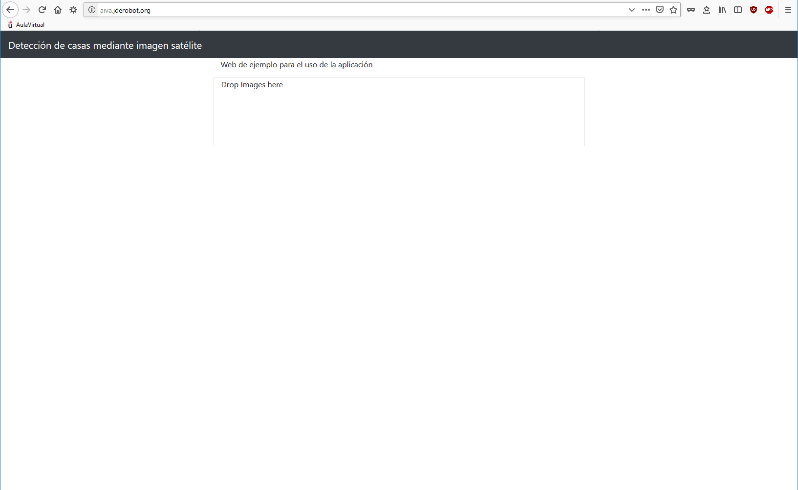
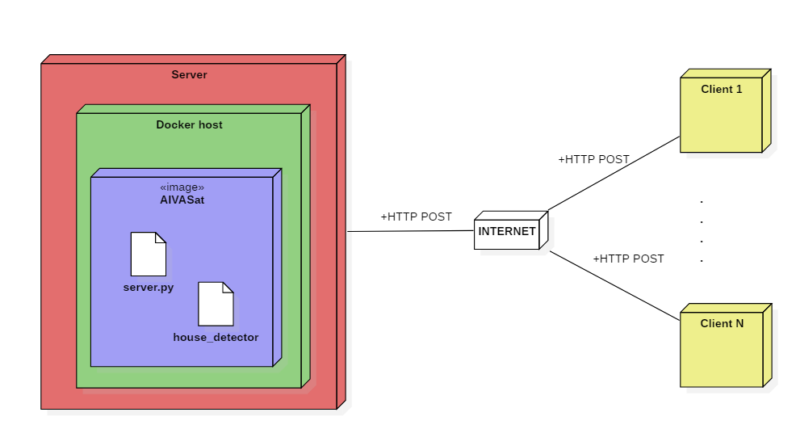
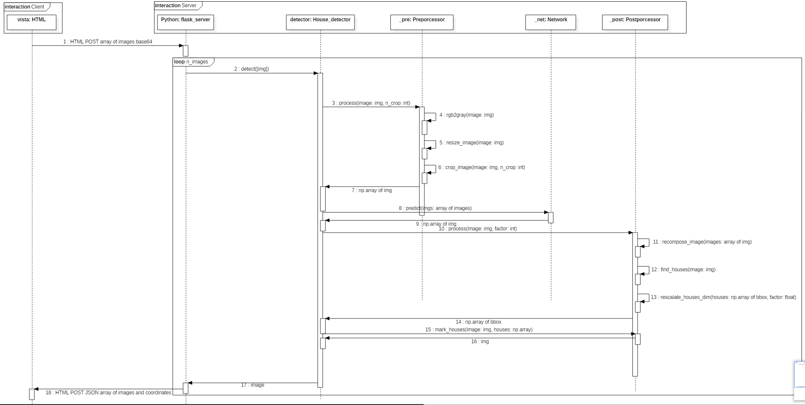
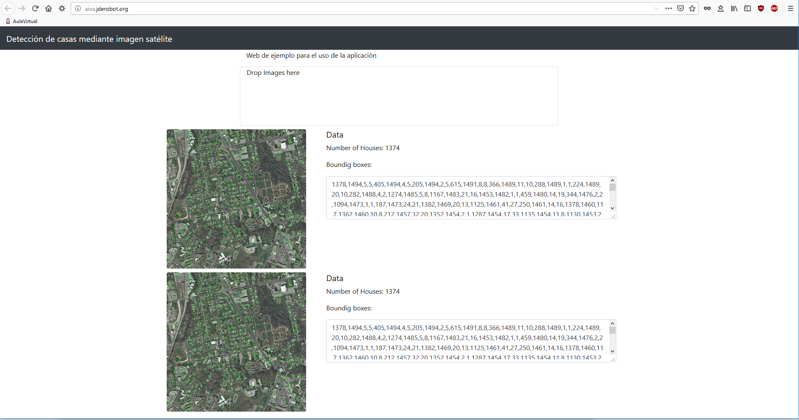

# Etapa de producción y despliegue

Esta es la última etapa del proceso de desarrollo del sistema de detección de tejados mediante imágenes satélite. En ella se describirá de forma global el sistema desarrollado, así como el diseño del despliegue del mismo.

## 1. Introducción

Se ha desarrollado un sistema automático de detección de tejados mediante imágenes satélite requerido por el cliente para que se pueda saber las áreas libres para la construcción en diferentes zonas geográficas del planeta. El fin último de esta aplicación es saber con certeza zonas libres de edificios para la construcción de parques infantiles, utilizando para ello visión artificial aplicada a imágenes satélite.

El sistema desarrollado consta de varias partes que se han ido explicando en las diferentes etapas de desarrollo de la misma, pero se resumen en esta sección. Mediante el algoritmo que se implementó en la etapa anterior, se ha realizado una capa web para ofrecer servicio a los usuarios, de forma que el sistema consta de un servidor en Flask al que se le pueden enviar peticiones conociendo la IP y puerto en el que escucha.

**Sistema de detección de tejados**

Este es el corazón del sistema ya que se encarga de realizar el procesamiento de imagen mediante el cual se da servicio al usuario. Esta parte del sistema se encarga de recoger la imagen proporcionada por el usuario, preprocesarla para alimentar una red neuronal especializada en segmentación de tejados para más tarde realizar algunas otras operaciones sobre la imagen obtenida de la red para presentarla al usuario final como información útil.

**Aplicación web**

Esta parte del sistema se ha desarrollado en esta etapa y se explicará con detalle en secciones posteriores de este documento. La aplicación web es una aplicación cliente-servidor clásica donde un servidor está a la espera de recibir imágenes para ser procesadas que el cliente le enviará. El servidor se encargará de invocar a la aplicación de detección de tejados para obtener la imagen final que será devuelta al cliente que solicitó el procesado de la misma. Por la simplicidad de la aplicación en este punto, se ha decidido implementar un sistema API REST con FLASK para el intercambio de información a través de la web en lugar de desarrollar un servidor completo de Django (que añade complejidad extra e innecesaria)

**Aplicación Python**

Esta parte del sistema es la aplicación subyacente al servidor web. Se encarga de realizar todo el trabajo de procesamiento de imagen y de uso de la red neuronal, como se explicó con detalle en la iteración anterior del proyecto.

**Docker**

Para el despliegue de la aplicación, se ha optado por usar contenedores Docker debido a su enorme flexibilidad y portabilidad. El sistema se desplegará en un contendor docker en un servidor remoto para que sea accesible a través del navegador sin que el usuario requiera de ningún tipo de instalación, haciendo del sistema desarrollado un servicio más que un producto. La imagen docker generada contendrá los elementos mínimos necesarios para el correcto funcionamiento del sistema con el fin de no hacer el contenedor demasiado pesado. Debido a su gran nivel de portabilidad, el sistema se podrá desplegar en servidores de casi cualquier tipo y con casi cualquier sistema operativo (todo aquel que soporte la instalación de Docker).

### 1.1 Instalación

El sistema se desplegará en un contendor docker dentro de un servidor, dado que se ofrecen dos opciones de uso de la aplicación: como servicio web o como aplicación python. En ambos casos el despliegue se puede realizar mediante una imagen de Docker, de tal forma que el sistema esté en un entorno funcional sea cual sea el hardware o sistema operativo sobre el que funciona.

**Instalación servicio web**

Para realizar la instalación del sistema es necesario tener instalada una versión operativa de Docker (instrucciones de instalación [aquí](https://docs.docker.com/v17.12/install/))

Una vez instalado Docker (el sistema ha sido desarrollado bajo la versión 18.09.4, la cual se recomienda), es hora de desplegar el sistema en la máquina de destino del cual se proponen unas especificaciones mínimas y recomendadas.

*Especificaciones mínimas*

* CPU: Intel core i3 (generación 6 o superior)
* RAM: 4GB
* GPU: integrada

*Especificaciones recomendadas*

* CPU: Intel Core i5 o i7 (7º u 8º generación)
* RAM: 8GB
* GPU: dedicada (con al menos 4GB de memoria de vídeo)

Se recomienda el uso de una GPU dedicada para agilizar el funcionamiento de la red (no se explica en esta iteración)

Una vez cumplidos los requisitos, sólo hay generar el contenedor Docker con una instrucción:

```bash
docker run -d --name NAME -p IP:PORT:5000 fqez/aiva:latest
```

donde:

* NAME: nombre que se quiera dar al contenedor
* IP: IP donde estará escuchando el servidor web
* PORT: puerto donde estará escuchando el servidor web.

Nótese que la imagen ya está subida a dockerhub, con lo que no es necesario construirla desde cero, con lo cual se ahorra tiempo y esfuerzo en el despliegue de la misma. Con esta sencilla instrucción ya debería ser accesible el servicio desde cualquier navegador; para probar solamente hay que abrir un navegador web e ingresar la IP y el puerto donde se ha desplegado el servicio. http://IP:PUERTO

Se recomienda encarecidamente dedicar una IP del servidor exclusivamente para el servicio, además de crear un dominio propio para el mismo. En nuestro caso de ejemplo, se puede acceder al servicio web a través de la siguiente URL: https://aiva.jderobot.org



Si se desea generar la imagen de Docker (NO SE RECOMIENDA) en lugar de utilizar la que está subida a Dockerhub, hay que hacer lo siguiente:

* Clonar el repositorio: `git clone https://github.com/fqez/AIVA-segmentacion-satelite AIVASat`
* Construir la imagen: `docker build -t aiva:latest .`

Con esto se generará una nueva imagen con en nombre **aiva** y etiqueta **latest** que se pueden cambiar al gusto. Esta imagen estará alojada en la máquina donde se ha construido, por lo que si se quiere distribuir es necesario subirla a DockerHub.

GitHub: https://github.com/fqez/AIVA-segmentacion-satelite

## 2. Despliegue

En esta sección se describe el diagrama de despliegue del sistema.



Se puede apreciar que el diagrama de despliegue es muy sencillo y que se ha implementado una arquitectura cliente-servidor clásica. El despliegue del sistema se llevará a cabo en una máquina que será el host del sistema implementado (ver especificaciones en la sección anterior). Esta máquina deberá disponer de una instalación del gestor de contenedores Docker, mediante el cual se instalará la imagen del sistema alojada en DockerHub (o en su defecto se construirá una a partir del Dockerfile del repositorio del proyecto). Como se puede apreciar, la imagen Docker en este ejemplo se llama *AIVASat* y contiene dos artefactos que son:

* **Server.py**: servidor FLASK que implementa un API REST para la gestión de las peticiones por parte de los clientes.
* **house_detector**: representa el sistema de VA subyacente al servicio web y es el que se encarga del procesamiento de la imagen (ver documentación de la etapa anterior para más detalle).

El servidor podrá estar abierto a peticiones desde internet, como funcionar en una red local o *localhost*. Es configurable para todos los tipos de arquitectura. Por su parte, los clientes serán los propios navegadores web de los usuarios, los cuales podrán acceder al servicio web mediante la IP y puerto donde escucha el servidor (se recomienda un dominio propio por seguridad) o bien, mediante un cliente en python desde su máquina que hará peticiones al servidor FLASK. En el repositorio del proyecto se ha implementado un cliente en python de ejemplo por si no se desea utilizar el interfaz web.

## 3. Funcionamiento del sistema

En esta sección se explica el funcionamiento del sistema de visión artificial implementado con la inclusión del servicio web que se ha desarrollado. Para explicar el funcionamiento del sistema completo, se ha desarrollado el siguiente diagrama de secuencia que no es más que una extensión del diagrama de secuencia de la etapa anterior añadiendo la parte web.



Como se puede apreciar, aparece una nueva entidad (el cliente) que es el que inicia la comunicación con el servidor. Una vez establecida la comunicación entre el cliente y el servidor a través del navegador web del cliente podrá enviar al servidor algunas imágenes mediante un mecanismo de *drag&drop* en el navegador. Cuando el cliente arrastra las imágenes que quiere que sean procesadas al navegador, automáticamente envía una petición al servidor mediante un comando POST de HTML llevando como contenido todas las imágenes proporcionadas en formato base64. El servidor por su parte recogerá todas las imágenes enviadas por el cliente y para cada una de ellas (bucle *loop*) las convertirá de nuevo a un formato entendible por OpenCV para su posterior procesamiento. A partir de aquí, el funcionamiento del sistema es exactamente igual al explicado en la etapa anterior, por lo que se omite. Una vez el sistema tiene las imágenes procesadas, así como el número de detecciones y sus coordenadas, las enviará de nuevo al servidor para enviar todos los datos obtenidos en un JSON con el array de todos los datos. La imagen se convertirá de nuevo a base64 para su envío final al cliente. Una vez en el cliente, las imágenes serán mostradas al usuario junto con los datos de número de detecciones y coordenadas de las mismas como se puede apreciar en la siguiente imagen:



En este punto del desarrollo, el cliente web aún no está completo, por lo que su uso es solo demostrativo del funcionamiento del sistema. Faltan botones para descargar los datos resultantes, así como la mejora de la experiencia de usuario y el aspecto visual. No obstante, si se quiere obtener la imagen resultante, basta con hacer click derecho sobre la misma y seleccionar la opcion "Guardar imagen como..." para poder descargarla a nuestro ordenador.