# Etapa de diseño de la solución.

## 1. Introducción

En este documento se tratará de explicar de forma breve, concisa y claramente el desarrollo realizado en referencia a los algoritmos de visión artificial, para la detección de tejados de edificaciones en imágenes satélite.

La principal línea de desarrollo ha sido la prueba de una red neuronal profunda llamada *UNet* la cual se encarga de segmentar imágenes satélite de edificios, separando los píxeles pertenecientes a edificios del fondo (resto de píxeles en la imagen). Tras haber probado la red y comprobado que la segmentación era aceptable para nuestro propósito, nos centramos en preparar los datos de entrada a la red con un algoritmo que pre-procesa la imagen antes de alimentar a la red neuronal de este tipo:

1. Convertir la imagen original satélite a escala de grises, con objetivo doble: (a) reducir la información por imagen de 3 canales de color a 1, con el fin de ganar eficiencia; y (b) la red trabaja con imágenes en escala de grises, por lo que este paso es necesario.
2. Reducir el tamaño de imagen de 5000x5000 píxeles a 1024x1024 píxeles.
3. Recortar la imagen en 4 fragmentos de igual tamaño (sin solapamiento), de tal forma que no se alimente a la red con imágenes demasiado grandes sino con fragmentos de la misma, que es como hemos comprobado que la red funciona mejor.

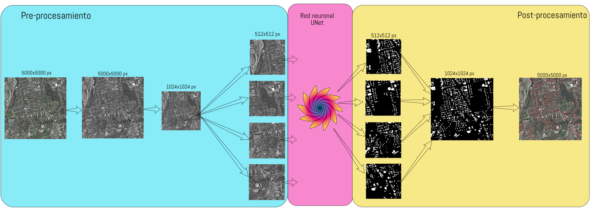

Tras este preprocesamiento, se alimenta a la red con las cuatro imágenes resultantes, de tal forma que la red se encargaría de segmentar 4 imágenes de 512x512 píxeles en lugar de una sola imagen de 5000x5000 píxeles.

La red neuronal que se utiliza es una red neuronal convolucional entrenada para detectar los tejados de los edificios en imágenes satélite, de tal forma que la salida de la misma es una imagen del mismo tamaño que la de entrada (512x512 píxeles) representando un mapa de calor representando las probabilidades de que cada píxel de la imagen pertenezca a un tejado de edificio o a fondo. Nuestra implementación, toma ese mapa de calor y lo umbraliza para obtener una imagen en banco y negro con los tejados segmentados.

Las imágenes que retorna la red neuronal, no contiene la información requerida por el cliente, ya que este desea la detección de los edificios, así como las coordenadas de los mismos. Es por esto que es necesaria una etapa de post-procesado de las imágenes resultantes para: (1) juntar todas las imágenes pre-procesadas para obtener una imagen del mismo tamaño que la imagen de entrada, (2) realizar la detección de los edificios en la imagen binaria mediante directivas de openCV y (3) marcar los edificios en la imagen original mediante *bounding boxes*. 

## 2. Diseño de la solución

En esta sección se detalla algo más en profundidad la implementación de la solución propuesta para el algoritmo de visión encargado de segmentar y localizar los edificios a partir de una imagen satélite de una zona geográfica del planeta.

### 2.1. Diagrama de clases

Para especificar el diseño del algoritmo de visión se ha realizado un diagrama estático de clases UML para dicho algoritmo. El diagrama es el siguiente:

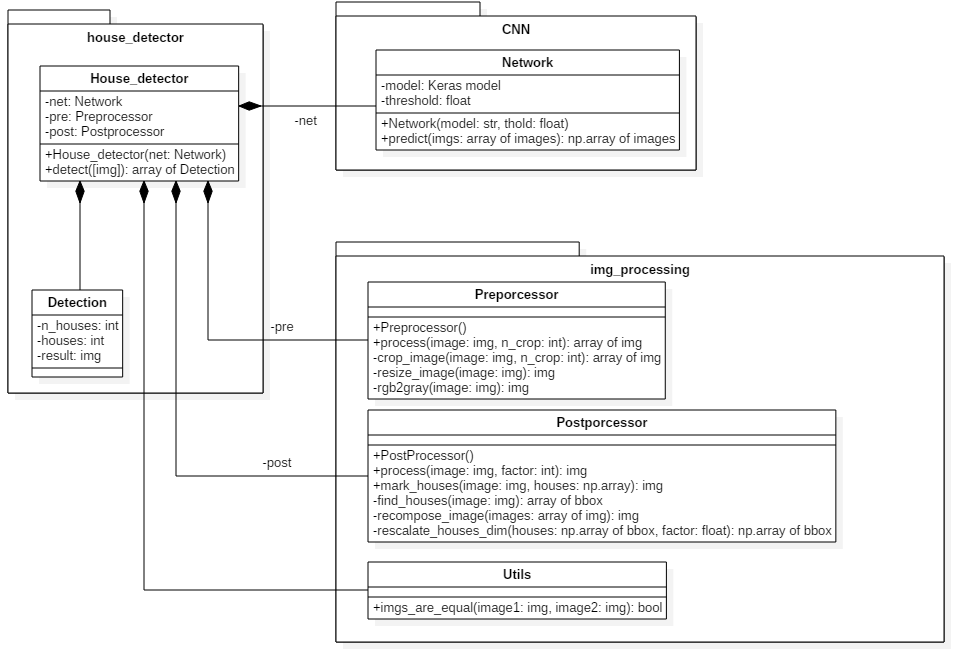

Cabe destacar que este diagrama no representa el conjunto del sistema para el problema propuesto, ya que falta la parte de interfaz y servidor web, que se detallará en posteriores iteraciones.

Como se puede apreciar, el diagrama de clases está dividido en diferentes paquetes con el fin de ordenar el código en diferentes directorios para hacerlo más flexible, escalable y manejable. En concreto, se han diseñado 3 paquetes diferentes que contienen las distintas clases que hacen funcionar al algoritmo de visión; a saber: paquete **house_detector** con las clases *House_detector* y *Detection*; paquete **CNN** con la clase *Network*; y paquete **img_processing** con las clases *Preprocessor, Postprocessor y Utils*.

Los paquetes se han creado en función de las clases que los contienen. El paquete *house_detector* contiene todo lo relacionado con la clase fachada, que es la que se va a encargar del grueso de la lógica del algoritmo. El paquete *CNN* se concibe para posible extensión del sistema utilizando diferentes redes neuronales para la segmentación. Por último, el paquete *img_processing* existe para dar cabida a todas las clases relacionadas con el procesamiento de imagen a bajo nivel utilizando la biblioteca OpenCV.

#### 2.1.1. Clase House_detector

**Atributos de clase:**

* *_net*: objeto tipo Network
* *_pre*: objeto tipo Preprocessor
* *_post*: objeto tipo Postprocessor

**Métodos de clase**

* Públicos:
  * *House_detector*: constructor de la clase (\_\_init\_\_ en python)
  * *detect*: método principal

Esta es la clase "fachada" que el sistema va a emplear para realizar toda la funcionalidad de la solución. La clase principal se denomina *House_detector* y consta de 3 atributos de clase (*_net*, *_pre* y *_post*) y un método público (*detect*) junto con un constructor de la clase.

Para realizar una instancia de esta clase, el constructor requiere de un modelo de red neuronal en formato `*.h5` de keras con los pesos de la red ya entrenada.

El método *detect* se encarga de realizar todo el procesamiento de la imagen, desde la llegada de la imagen facilitada por el usuario (imagen de 5000x5000 píxeles) hasta el retorno de la imagen resultante con los datos adicionales requeridos por el cliente. Éste método toma un array de imágenes de entrada de 5000x5000 píxeles y para cada una de ellas realizará el siguiente procesamiento:

1. Haciendo uso de su atributo *_pre* de la clase *Preprocessor*, realizará un pre-procesado de la imagen de entrada con el objetivo de dejar los datos listos para alimentar a la red neuronal que tomará el relevo en la siguiente etapa (ver sección 2.1.2 para mayor detalle).
2. Con la salida de la etapa de preprocesamiento, tendremos 4 imágenes de un tamaño de 512x512 píxeles correspondientes a la división de la imagen original en 4 trozos de igual tamaño. Estas 4 imágenes serán los datos de entrada de la red neuronal convolucional *UNet*, que se encargará de segmentar los edificios en la imagen del fondo dando como resultado 4 imágenes en blanco y negro umbralizadas con el resultado deseado correspondientes a las 4 imágenes de entrada. Para ello, se utiliza el objeto *_net* de la clase *Network*(ver sección 2.1.3 para mayor detalle).
3. Una vez obtenidas las imágenes segmentadas, se requiere un post-procesamiento de las mismas con el fin de pegar los 4 trozos de vuelta en una sola imagen, y detectar los *bounding boxes* de las casas, así como sus coordenadas en la imagen. Para realizar este post-procesamiento, se utiliza el objeto *_post* de la clase *Postporcessor* (ver sección 2.1.4 para mayor detalle).
4. Una vez realizado el post-procesado de la imagen, se utiliza otro método de la clase *Postprocessor* para pintar los *bounding boxes* en la imagen original, que ya estará lista para entregar de vuelta al usuario del sistema.

|                  Entrada                   |                    Salida                    |
| :----------------------------------------: | :------------------------------------------: |
|  |  |

#### 2.1.2 Clase Preprocessor

**Atributos de clase:** No tiene

**Métodos de clase**

- Públicos:
  - *Preprocessor*: constructor de la clase (\_\_init\_\_ en python)
  - *process*: método principal
- Privados:
  - *crop_image* : método que recibe una imagen y la divide en 4 trozos del mismo tamaño.
  - *resize_image*: método que recibe una imagen y la reescala a un tamaño de 1024x1024 píxeles.
  - *rgb2gray*: método que recibe una imagen y transforma su espacio de color de BGR a escala de grises.

Esta clase se encarga de realizar todo el pre-procesado de la imagen de entrada, con el fin de dejarla lista para alimentar la red neuronal de la etapa posterior. La clase consta de un constructor por defecto para poder instanciar objetos de la misma, denominada *Preprocessor*. Además tiene un único método público más, denominado *process*, que es el que se encarga del grueso del algoritmo apoyándose en el resto de métodos privados. El método *process* seguirá el siguiente algoritmo:

1. Tomará la imagen de entrada ofrecida por la clase *House_detection* de la etapa anterior y convertirá su espacio de color de BGR a escala de grises utilizando directivas de OpenCV incluídas en el método *rgb2gray* de la clase.
2. Más tarde, el tamaño de la imagen será reducido de sus 5000 $px^2$ originales a 1024 $px^2​$. Este paso se ha comprobado necesario, ya que la red neuronal utilizada (*UNet*) da mejores resultados con imágenes con menor resolución además de ser más rápida.
3. Acto seguido, tomará la imagen en escala de grises redimensionada (a 1024x1024 píxeles) y la dividirá en 4 trozos de idéntico tamaño (512x512 píxeles) haciendo uso del método *crop_image* de la clase. Éste método devolverá a las 4 imágenes recortadas en un array.

Terminado este proceso, el método *process* devolverá las 4 imágenes en escala de grises y redimensionadas a 512x512 píxeles.

|                  Entrada                   |                            Salida                            |
| :----------------------------------------: | :----------------------------------------------------------: |
|  | 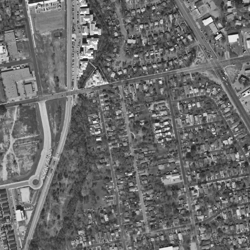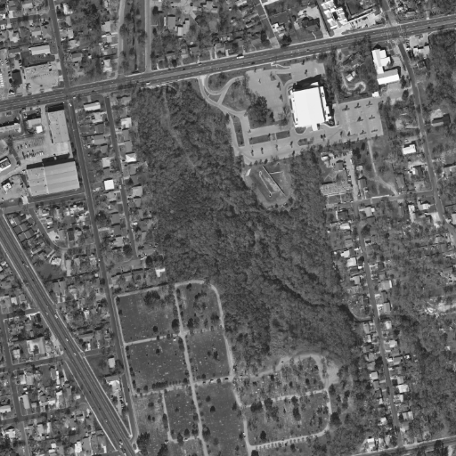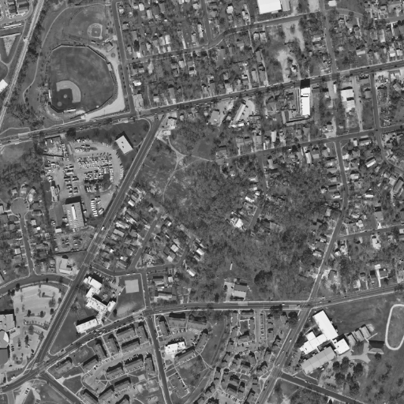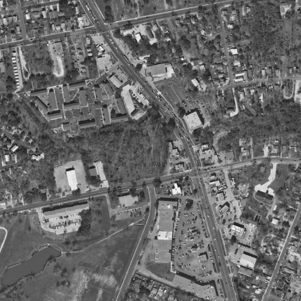 |

#### 2.1.3 Clase Network

**Atributos de clase:**

- *model*: red entrenada en formato  `*.h5` de Keras.
- *threshold*: valor del umbral para binarizar la imagen resultante de la red.

**Métodos de clase**

- Públicos:
  - *Network*: constructor de la clase (\_\_init\_\_ en python)
  - *predict*: método principal

Esta clase es una de las más sencillas de la solución al hacer únicamente uso de una red Keras previamente entrenada para el propósito de segmentar edificios de una imagen satélite. Esta clase consta de un constructor que recibe dos parámetros: *model* el modelo de la red en formato `*.h5` y *thold* que es el valor del umbral mediante el cual se va a umbralizar la imagen resultante.

El método *predict*, no es más que una llamada al método *predict* de la red neuronal que se encargará de segmentar las imágenes de entrada (recibidas como parámetro) y una vez obtenidas las imágenes segmentadas umbralizarlas de acuerdo al valor del umbral *threshold*.

|                  Entrada                   |                            Salida                            |
| :----------------------------------------: | :----------------------------------------------------------: |
|  | 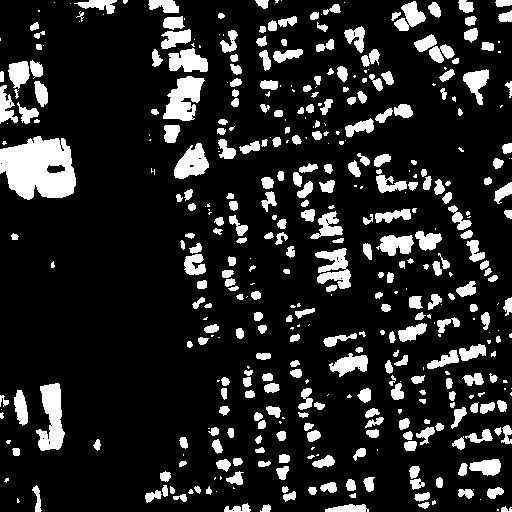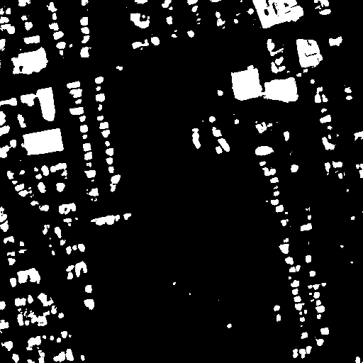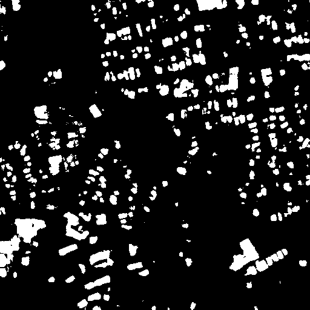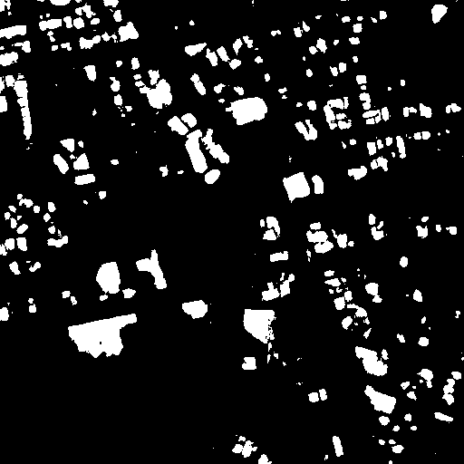 |

#### 2.1.4 Clase PostProcessor

**Atributos de clase**:No tiene

**Métodos de clase**

- Públicos:
  - Postprocessor: constructor de la clase (\_\_init\_\_ en python)
  - *process*: método principal
  - *mark_houses*: método que recibe una imagen y un vector de *bounding boxes (x,y,w,h)* y las pinta en la misma.
- Privados:
  - *find_houses*: método que recibe una imagen y retorna un array de *bounding boxes* asociados a cada una de las detecciones.
  - *recompose_image*: método que recibe 4 imágenes y las recompone en una sola.
  - *reescalate_houses_dim*: método que recibe un array de *bounding boxes* y un factor de escala y reescala la información de las *bounding boxes* en función del factor de escala.

La clase tiene un constructor por defecto para poder instanciar objetos de la misma. Esta clase se encarga de realizar todo el post-procesado de la imagen mediante el método *process* siguiendo el siguiente algoritmo:

1. A la entrada de este método llegarán las 4 imágenes umbralizadas de la etapa anterior (ver sección  2.1.3). Dado que el usuario final requiere de una sola imagen a color, con las casas marcadas e información de coordenadas de las mismas, se requiere como primer paso "pegar" las 4 imágenes de vuelta para formar una sola. De esta operación se encarga el método *recompose_image*.
2. Una vez recompuesta la imagen, recordemos que la imagen tiene un tamaño actual de 1024x1024 píxeles, se realiza una detección de los tejados sobre la imagen umbralizada, de tal forma que utilizando directivas de OpenCV se pueda conocer las coordenadas de cada uno de los edificios. De esta tarea se encarga el método *find_houses*, que devolverá un array con la información de los *bounding boxes* de las detecciones realizadas.
3. Por último, dado que la imagen que se va a devolver al cliente es de 5000x5000 píxeles y se ha realizado la detección de los edificios en una imagen de 1024x1024 píxeles, es necesario adecuar la información de los *bounding boxes* devueltos por el método *find_houses* de tal forma que se adecúe al tamaño de imagen original. Para hacer esta tarea, se crea el método *rescalate_houses_dim*.

|                           Entrada                            |                   Salida                    |
| :----------------------------------------------------------: | :-----------------------------------------: |
|  | `[[100,100,23,45], [130,200, 33, 19], ...]` |

Esta clase cuenta con un método público extra denominado *mark_houses*, el cual recibe una imagen de 5000x5000 píxeles y la información de *bounding boxes* de la etapa de post-procesado y devuelve la imagen con las *bounding boxes* pintadas sobre la imagen.

|                  Entrada                   |                    Salida                    |
| :----------------------------------------: | :------------------------------------------: |
|  |  |

Contamos con dos clases extra llamadas *Detection* y *Utils*. La primera de ella fue descartada dado que la sintaxis de python (lenguaje de programación con el que se ha programado la solución) la hace prescindible. La segunda clase extra (*Utils*) se diseña para su utilización en la etapa de tests, en concreto en el test de detección de edificios (sección 3.4). Finalmente su uso no ha sido necesario. Ambas clases se conservan por un posible uso futuro.

### 2.2. Diagrama de secuencia

Los diagramas de clases son útiles para comprender la abstracción detrás de la solución propuesta; no obstante, en esa clase de diagramas no se entiende de manera inmediata el funcionamiento del algoritmo como tal, ya que no expresa conocimiento acerca de comunicaciones entre clases e intercambio de mensajes. Para esta tarea, los diagramas de secuencia son ideales, ya que se pude ver a simple vista la relación entre las diferentes clases, el tipo de información que intercambian y los tiempos de vida de los objetos involucrados en el algoritmo.

Se propone el siguiente diagrama de secuencia para una ejecución típica del algoritmo de visión:

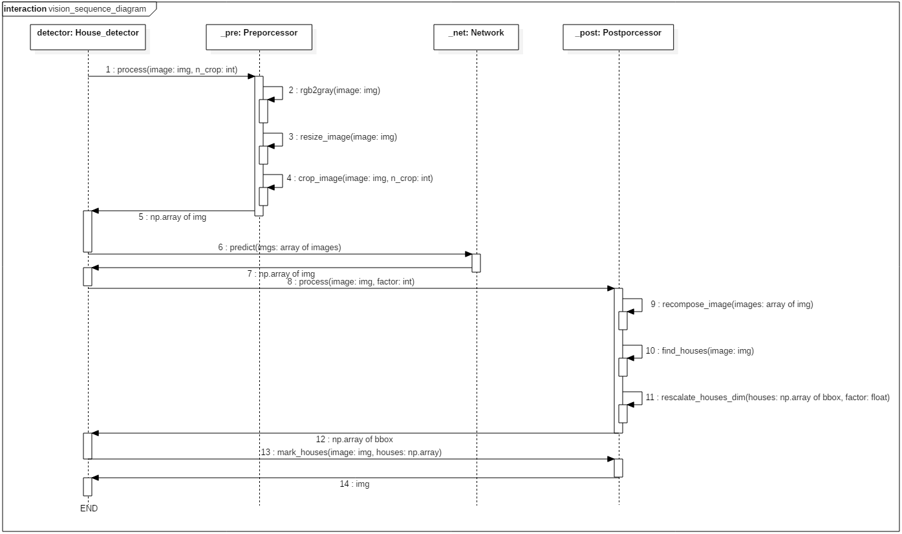

En este diagrama se pueden observar diferentes elementos que se irán desgranando a continuación. El número de objetos (instancias de clase) que intervienen en este ejemplo son 4: *detector* del tipo *House_detector*, *_pre* del tipo *Preprocessor*, *_post* del tipo *Postprocessor* y *_net* del tipo *Network*. El objeto más importante y el que lleva la batuta de todo el algoritmo el *detector*, que es el que se encarga de pedir al resto de objetos la funcionalidad requerida en cada momento. La secuencia de acontecimientos sería la siguiente:

1. El objeto *detector* inicia su vida. Su primera tarea consiste en pedirle al objeto *_pre* que ejecute la funcionalidad de su método *process* pasándole la imagen facilitada por el usuario (de 5000x5000 píxeles) y el numero de imágenes en las que quiere subdividir dicha imagen para tal cometido. El objeto *_pre* inicia el método *process*
2. *_pre* realiza una invocación a uno de sus métodos: *rgb2gray* pasándole la imagen de entrada (de 5000x5000 píxeles) para que la convierta a un espacio de color en escala de grises con un solo canal. 
3. Obtenida la imagen en escala de grises, *_pre* invocará a otro de sus métodos: *resize_image*, pasándole la imagen de entrada (de 5000x5000 píxeles) para que la reescale a un tamaño de 1024x1024 píxeles.
4. Con la imagen reescalada (1024x1024 píxeles), *_pre* realizará una última invocación a uno de sus métodos privados: *crop_image*, pasándole esta imagen y el número de subdivisiones requeridas. *crop_image* subdividirá la imagen (de 1024x1024 píxeles) en otras 4 imágenes del mismo tamaño (de 512x512 píxeles).
5. En este momento *_pre* retornará de la llamada devolviendo al objeto *detector* un array con las 4 imágenes (de 512x512 píxeles) que ha obtenido en la etapa de preprocesamiento.
6. Obtenidas las imágenes desde *_pre*, el objeto *detector* realizará ahora una invocación al método público de *_net*: *predict* pasándole las 4 imágenes resultantes de la etapa de pre-procesamiento.  El objeto *_net* inicia el método *predict.*
7. *_net* realizará una llamada al método *predict* de la red neuronal, que devolverá la detección de los edificios en las 4 imágenes en formato mapa de calor. Acto seguido umbralizará las imágenes resultantes convirtiéndolas en imágenes binarias (de 512x512 píxeles) para la etapa de post-procesado y devolviendo las mismas al objeto *detector*.
8. Obtenidas las imágenes desde *_net*, el objeto *detector* realizará ahora una invocación al método público de *_post*: *process* pasándole las 4 imágenes resultantes de la etapa de la red neuronal.  El objeto *_post* inicia el método *process*.
9. *_post* realiza una invocación a uno de sus métodos privados: *recompose_image* pasándole las 4 imágenes umbralizadas (de 512x512 píxeles) para ser recompuestas en una sola imagen (de 1024x1024 píxeles).
10. Obtenida la imagen recompuesta, *_post* realiza llamada a otro de sus métodos privados: *find_houses*, pasándole dicha imagen para que el método pueda obtener las *bounding boxes* de las casas que aparecen en la imagen utilizando directivas de OpenCV. En este paso se obtiene un array con la información de las *bounding boxes* (una por detección realizada) dando coordenadas x,y de inicio de la caja y su altura y anchura.
11. *_post* realizará una última invocación a otro de sus métodos privados: *rescalate_houses_dim*, pasándole el array de *bounding boxes* obtenido en la etapa anterior para reescalar dicha información. Recuérdese que la detección se hará sobre la imagen de 1024x1024 píxeles, mientras que el resultado final debe estar en notación de imagen de 5000x5000 píxeles.
12. La información de los *bounding boxes* reescalados se devuelve al objeto *detector*
13. *detector* realiza una última llamada a uno de los métodos públicos de *_post*: *mark_houses* pasándole la imagen original (de 5000x5000 píxeles) y la información de los *bounding boxes* pertenecientes a cada casa, para que éste método pinte esa información en la imagen
14. La imagen original con los *bounding boxes* pintados es devuleta al objeto *detector* para ser devuelta al usuario.

## 3. Diagramas de actividad

Los diagramas de secuencia tienen la carencia de que no contemplan funcionamiento más allá de una ejecución ideal y sin errores, además de no controlar aspectos de implementación como bifurcaciones en el flujo de funcionamiento del algoritmo. Por ello, los diagramas de actividad son útiles para conocer cómo funcionan los algoritmos de forma algo más detallada y a bajo nivel.

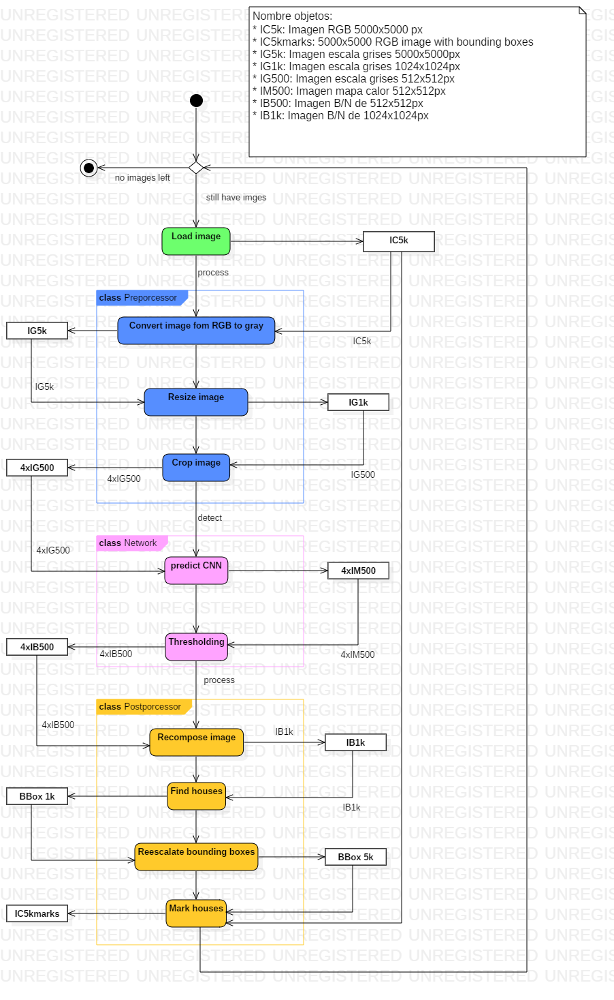

En esta sección se proponen 4 diagramas de actividad correspondientes a los bloques algorítmicos más importantes de la solución: algoritmo de *House_detection*, algoritmo de *Preprocessor*, algoritmo de *Network* y algoritmo de *Postprocessor*

#### 3.1. Algoritmo *House_detection*

Este algoritmo es el que lleva la batuta en la solución propuesta. Corresponde a la clase *House_detector* (sección 2.1.1) y se encarga de sincronizar todo el proceso. 

Es el punto de entrada del algoritmo de visión y tiene cuatro acciones principales (a muy alto nivel). Esta clase tiene como entrada un bucle, que recorre el vector de imágenes de entrada que se le haya pasado y para cada una de ellas realiza las acciones: *Load image, preprocess, CNN prediction y Postprocess*. No se detalla el funcionamiento de cada estado en esta sección ya que se hará en secciones posteriores. Sólo se comenta, que de la acción *Load image* se genera un objeto IC5k (Imagen a color de 5000x5000 píxeles), que alimentará los siguientes estados del algoritmo.

#### 3.2. Algoritmo *Preprocess*

Esta parte de la solución corresponde con la clase *Preprocess* (ver sección 2.1.2) y es el que se encarga de preparar los datos de entrada de la red para adecuarlos a un formato válido para la misma.

Este algoritmo consta de 3 acciones: *Convert to gray, resize image y crop image* correspondientes a las funciones *rgb2gray, resize_image y crop_image* respectivamente de la clase *Preprocessor*. El objeto de entrada en esta etapa es IC5k  (Imagen a color de 5000x5000 píxeles), que alimentará la acción *convert to gray*, dando como resultado un objeto IG1k (Imagen en escala de grises de 1024x1024 píxeles), que a su vez alimentará la siguiente acción *crop image* que tendrá como resultado otros 4 objetos IG500 (imagen en escala de grises de 512x512 píxeles). El funcionamiento de esta etapa se describe detalladamente en la sección 2.1.2.

#### 3.3. Algoritmo *Network*

Esta parte de la solución corresponde con la clase *Network(ver sección 2.1.3) y es el que se encarga de alimentar a la red neuronal convolucional y obtener su resultado para posteriormente umbralizar las imágenes resultantes.

Este algoritmo costa de dos acciones: *predict CNN y Thresholding* encargadas de obtener los resultados de la red neuronal y umbralizar dicho resultado respectivamente. El objeto entrante en esta etapa son 4 objetos  IG500 (imagen en escala de grises de 512x512 píxeles) que alimentarán la red neuronal. La acción *predict CNN* generará 4 objetos del tipo IM500 (imagen mapa de calor de 512x512 píxeles), que serán umbralizadas (acción *Thresholding*) para obtener otros 4 objetos del tipo IB500 (imagen en blanco y negro de 512x512 píxeles) que alimentarán la etapa siguiente. El funcionamiento detallado de este algoritmo se describe en la sección (2.1.3)

#### 3.4. Algoritmo *Postprocess*

Esta parte de la solución corresponde con la clase *Postprocess* (ver sección 2.1.4) y es el que se encarga de preparar los datos de entrada de la red para adecuarlos a un formato válido para la misma.

Por último, este algoritmo consta de 4 acciones: *recompose image, find houses, rescalate bboxes y mark houses*. El objeto de entrada es el de la salida de la etapa anterior: 4 objetos del tipo IB500 (imagen en blanco y negro de 512x512 píxeles), que alimentan la accion *recompose image* que generará un objeto de tipo IB1k (Imagen en blanco y negro de 1024x1024 píxeles). Esta acción habrá pegado las cuatro imágenes de entrada en una única imagen. Más tarde, la acción *find houses* recibirá el objeto IB1k para detectar los edificios en la imagen umbralizada generando un objeto BBox1k (array de *bounding boxes* con las detecciones para la imagen de 1024x1024 píxeles), siendo necesaria la siguiente acción: *rescalate bboxes* que recibirá el objeto BBox 1k para generar otro objeto BBox 5k (array de *bounding boxes* con las detecciones para la imagen de 5000x5000 píxeles). Por último, la acción *mark houses* recibirá tanto la imagen original de 5000x5000 píxeles como la información de *bounding boxes* para pintar estas últimas en la imagen de 5000x5000 píxeles. Este algoritmo se detalla en la sección 2.1.4.

## 4. Tests

Se han realizado diferentes tests unitarios para diferentes partes del sistema; en concreto: para la red neuronal, para el detector de edificios, para la etapa de pre-procesado y por último para la etapa de post-procesado.

### 4.1 Test etapa: pre-procesamiento

La clase de test de preprocesamiento (llamada `TestPreprocessor`) contiene 4 métodos correspondientes a 4 tests unitarios para cada uno de los métodos de nuestra clase `Preprocessor`.

1. El test `test_img2gray` comprueba que el paso de la imagen a escala de grises da como resultado una imagen en escala de grises idéntica a la que tenemos como referencia.

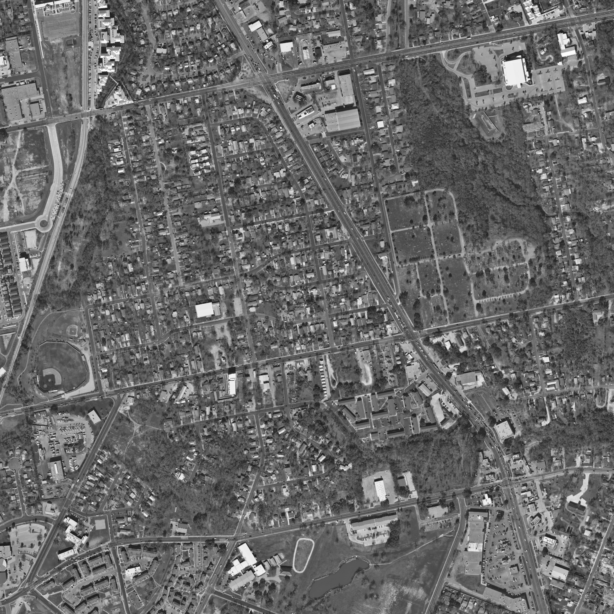

2. El test `test_resize_img` comprueba que la imagen reescalada es idéntica a la imagen reescalada que tenemos como referencia.

3. El test `test_crop_image`compruba que las imágenes recortadas de la imagen original son idénticas a las imágenes recortadas que tenemos como referencia.

 

  

    
  

  

    
  

  

    
  

  

    
  

 

4. El test `test_process` comprueba que el proceso completo en la etapa de preproceso devuelve las cuatro mismas imágenes que tenemos como referencia para esta etapa del algoritmo.

### 4.2 Test etapa: red neuronal

La clase de test para probar el correcto funcionamiento de la red neuronal (clase de test llamada `TestNetwork `) contiene 1 sólo método (llamado `test_predict`) que comprueba si la salida de la red para las 4 imágenes proporcionadas de la etapa anterior es idéntica a la salida de referencia de la red.

 

  

    
  

  

    
  

  

    
  

  

    
  

 

### 4.3 Test etapa: post-procesamiento

La clase de test de preprocesamiento (llamada `TestPostprocessor`) contiene 5 métodos correspondientes a 4 tests unitarios para cada uno de los métodos de nuestra clase `Postprocessor`.

1. El test `test_recompose_image` comprueba que la recomposición de la imagen a partir de los 4 fragmentos en los que fue dividida es idéntica a la imagen recompuesta de referencia para este test.

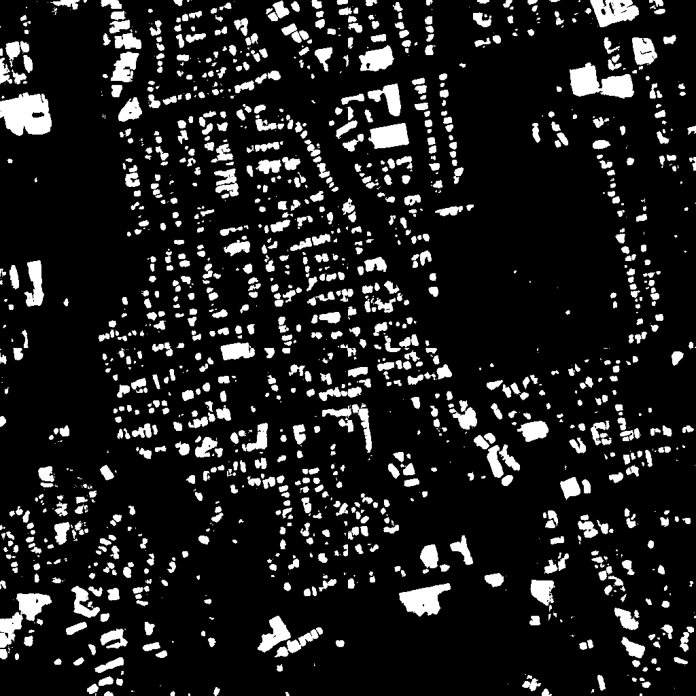

2. El test `test_find_houses` comprueba que los arrays de detección de edificios para una imagen de entrada, corresponde con el array de referencia para esa misma imagen.
3. El test `test_rescalate_houses_dims`comprueba que la imagen resultante de deshacer el reescalado de 5000$px^2$ a 1024$px^2​$ tiene un resultado idéntico a la imagen resultante de referencia.
4. El test `test_process` tiene como objetivo comprobar que toda la etapa de postprocesado funciona correctamente, alimentándose este test de los 4 fragmentos de la imagen devueltos por la red y comparando el resultado del post-procesado con la imagen resultante de referencia.
5. El test `test_mark_houses`comprueba que los *bounding boxes*  pintados en la imagen resultante son idénticos a los pintados en la imagen de referencia para este test.

### 4.4 Test etapa: detección de edificios

La clase de test para comprobar que la detección de casas es correcta. Esta clase comprueba que todo el proceso que realiza el algoritmo (todas las etapas anteriores) funcionan correctamente. Por lo que su entrada es la imagen original y comprobará que la salida es idéntica a la imagen de referencia resultante de la aplicación de todo el proceso.

